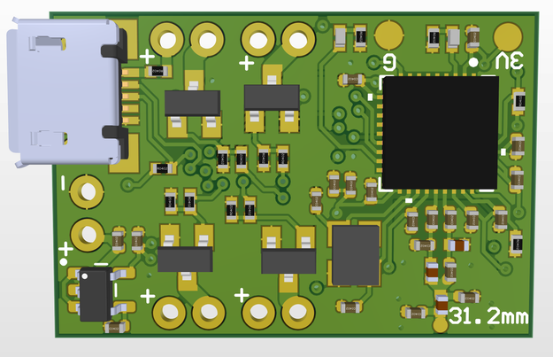
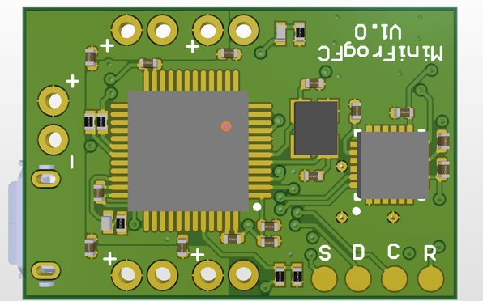

# MiniFrogFC
A Flight Controller For Brushed Motor Quadcopters    

This is the v1.0 layout which still needs some refinement.

## About
This is a personal project to develop a custom PCB flight controller designed in Altium. The size is currently 27mm x 18mm which is smaller than many commercially available options :)

## Major Components

**STM32F303CCT6:** F3 microcontroller  
**CC2510F32RHHR:** RF microcontroller for integrated FrSky receiver  
**MPU-6050:** Gyroscope and accelerometer IC  

## FrSky Compatability
The built in FrSky compatible receiver is based off the [uSky](https://github.com/fishpepper/uSKY) receiver design 
running [OpenSky](https://github.com/fishpepper/OpenSky) firmware developed by [fishpepper.](https://github.com/fishpepper)  
Thanks to fishpepper for publishing the design under an opensource license! 

## BetaFlight Compatibility

This flight controller is designed to be compatible with a popular open source FC software program called [BetaFlight.](https://github.com/betaflight) 
I have developed a new target for this custom flight controller here: [MiniFrogFC_Betaflight](https://github.com/CraigCrundwell/MiniFrogFC_Betaflight)  
Thanks to the BetaFlight team for their incredible work!  

**Note:** BetaFlight 4.0.6 is the last version that supports F3 based flight controllers. This custom target can not be built on newer versions!  

## The MiniFrogFC Name
I think frogs are neat...  
Other flight controllers have creative names much better than my original "Brushed Quadcopter FC."  
This name is one of a few I thought of in 5 minutes that didn't return strange results when entered on Google.  
Meh, we are just going to roll with it. 

## Versions

The V1.0 board layout is near completion and will be tested soon. The receiver subsystem has been tested on another design.
