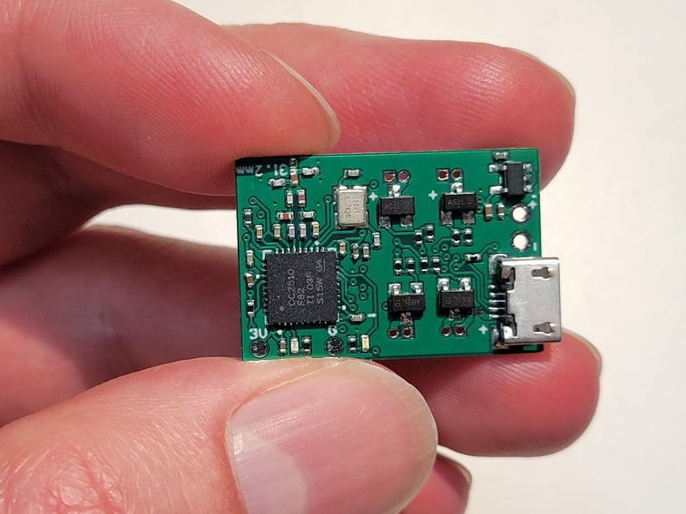
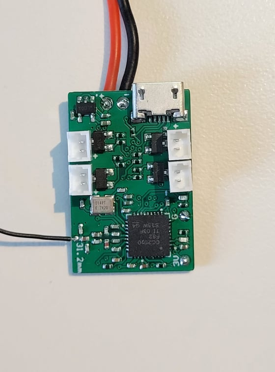
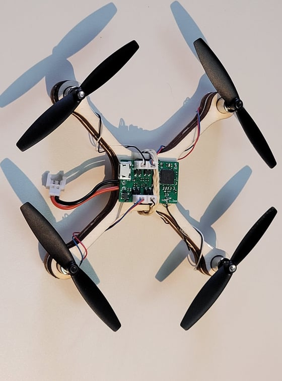
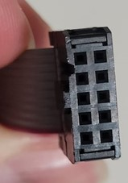
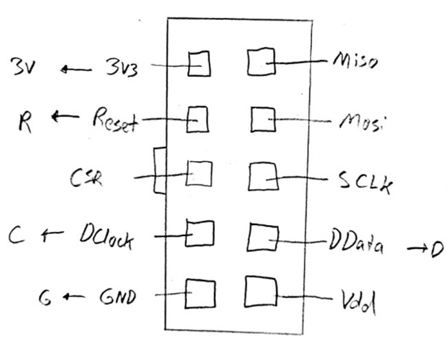
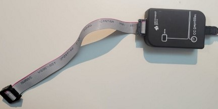
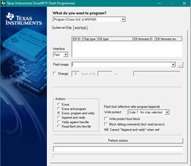
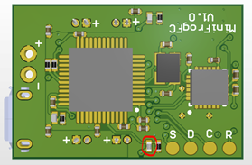
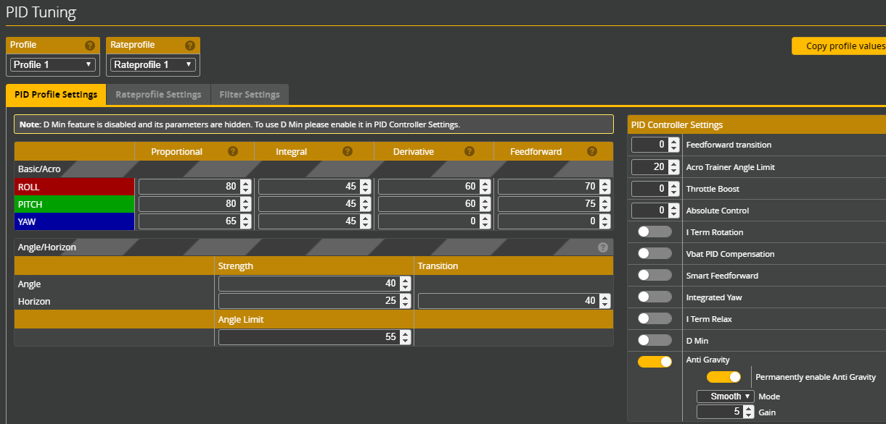

# MiniFrogFC
A Flight Controller For Brushed Motor Quadcopters    

## About
This is a personal project to develop a custom PCB flight controller designed in Altium. The size is currently 27mm x 18mm which is smaller than many commercially available options :) 

## Major Components

**STM32F303CCT6:** F3 microcontroller  
**CC2510F32RHHR:** RF microcontroller for integrated FrSky receiver  
**MPU-6050:** Gyroscope and accelerometer IC  

## FrSky Compatability
The built in FrSky compatible receiver is based off the [uSky](https://github.com/fishpepper/uSKY) receiver design 
running [OpenSky](https://github.com/fishpepper/OpenSky) firmware developed by [fishpepper.](https://github.com/fishpepper)  
Thanks to fishpepper for publishing the design under an opensource license! 

## BetaFlight Compatibility

This flight controller is designed to be compatible with a popular open source FC software program called [BetaFlight.](https://github.com/betaflight) 
I have developed a new target for this custom flight controller here: [MiniFrogFC_Betaflight](https://github.com/CraigCrundwell/MiniFrogFC_Betaflight)  
Thanks to the BetaFlight team for their incredible work!  

**Note:** BetaFlight 4.0.6 is the last version that supports F3 based flight controllers. This custom target can not be built on newer versions!  

## The MiniFrogFC Name
I think frogs are neat...  
Other flight controllers have creative names much better than my original "Brushed Quadcopter FC."  
This name is one of a few I thought of in 5 minutes that didn't return strange results when entered on Google.  
Meh, we are just going to roll with it. 

## Versions

The V1.0 board layout is complete and fully tested.

## PCB Build Notes  
1. Measure the antenna from a thin flexible wire as close to 32.2mm as possible with a ruler
2. The flight controller should be powered with a battery when plugged into USB only if R9 is not populated. Otherwise, don’t plug in the battery at the same time as the USB. 

## Receiver Flashing  
1.	Disconnect the USB and battery from the flight controller so that only the CC Debugger will power the flight controller.
2.	Solder wires onto the GND, 3V, CLK, DATA, and RESET pads on the flight controller labelled G, 3V, D, C, and R respectively. Connect the wires from the flight controller to the plug on the ribbon cable as shown below. Note the notch on the left side of the CC Debugger ribbon cable plug is shown in the drawing for orientation.  

  
3.	Connect the CC Debugger USB to the computer. Make sure CC debugger drivers are installed first and that it shows up in device manager under "cebal controller devices"  
  
5.	With the CC Debugger plugged in and the 5 wires connected to the flight controller, press the reset button on the CC Debugger. If everything is correct the light should turn green on the debugger. 
6.	Get the compiled hex file eg “MiniFrogFC_Receiver_binary_PPM” from the firmware folder

  
  
7.	(In windows) open Texas Instruments “Smart RF Flash Programmer”  
8.	Browse to the compiled hex file under “flash image”
9.	Click “perform actions” to flash the binary

## Receiver Binding  
1.	On a FrSky compatible transmitter, configure a model with international D8 mode.
2.	Power the flight controller while shorting the data pad “D” to GND “G”.
3.	Hold the transmitter about a meter away and enter bind mode. 
4.	Power cycle the flight controller. 

## Betaflight Target Flashing
1.	Power the flight controller while shorting the pads of the unplaced resistor R15 in the image below. This places the flight controller in DFU mode.  
 
2.	On Betaflight go to the flashing page and make sure the “No Reboot Sequence” and “Full Chip Erase” are selected.
3.	Select “Load Firmware [Local]” and browse to the binary file eg “betaflight_4.0.6_MINIFROG_FC.hex”.
4.	Flash the firmware then power cycle the flight controller.
5.	The flight controller should now show up as a USB port when plugged in. 

## Betaflight Configuration (Instructions for configurator version 10.7.0)
1.	Under configurations tab, set the board and sensor alignment to 180-degree roll and 90-degree yaw.
2.	Set the gyro update frequency to a maximum of 4.00 kHz and the PID loop frequency to 2.00 kHz.
3.	Set the receiver to PPM RX input in the configuration tab, and ensure the channel mapping is correct in the receiver tab.
4.	Set the ESC/Motor to Brushed with 32000 motor PWM frequency. 
5.	Set the PIDs as shown below. Note these will need to be adjusted for different quadcopter builds but they are a good starting point for 7mm brushed builds. 
 
6.	Set the modes for acro, horizon, airmode, etc.
7.	Turn off blackbox logging, and disable permanent airmode.
8.	Be sure to save and reboot where necessary. 
9.	FLY!

## Improvements  
1.	Add a diode to allow for the battery and USB to be connected at once
2.	Add a voltage divider connection to the STM32 from the battery to monitor the voltage
3.	Add polarity markings to the LED footprints silkscreen
4.	Add an arrow for flight controller mounting orientation

# Advanced Development Notes 

## Basic outline to build a receiver binary:
1.	Download the USKY github repo on linux
2.	sudo apt-get install sdcc
3.	sudo apt-get install srecord
4.	If there is an error for python not found on make:  
  a.	sudo apt-get install python2-minimal  
  b.	cd /usr/bin  
  c.	sudo ln -s /usr/bin/python2.7 /usr/bin/python  
5.	In the USKY repo run:  
  a.	export TARGET=USky  
  b.	make  
  
  ## Basic notes on Betaflight configurator use in Linux:
To fix error: "Are udev rules installed correctly? See docs for instructions" when flashing firmware open terminal and enter:  

(echo '# DFU (Internal bootloader for STM32 MCUs)'; echo 'SUBSYSTEM=="usb", ATTRS{idVendor}=="0483", ATTRS{idProduct}=="df11", MODE="0664", GROUP="plugdev"') | sudo tee     /etc/udev/rules.d/45-stdfu-permissions.rules > /dev/null^C  

 then replace <username> with computer user name and enter:  
 sudo usermod -a -G plugdev <username>  

To resolve error of unable to connect to a flashed board, replace <username> with computer user name and enter:  
sudo usermod -a -G dialout <username>

